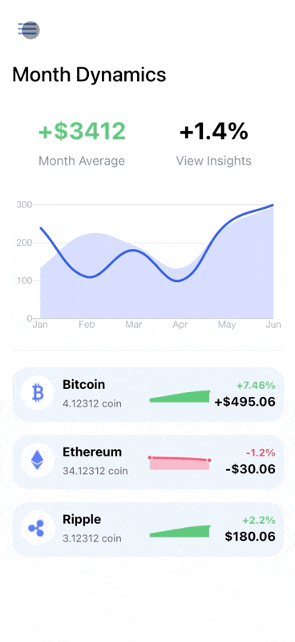

# Crypto App
---

Estilo desarrollado con [Ionic](https://ionicframework.com/) basado en el [diseño](https://dribbble.com/shots/9956276-Crypto-Coil-Mobile) de [Halo Lab](https://dribbble.com/halolab).

> No se puede comercializar, el proyecto está concebido para aquel que quiera aprender a realizar animaciones sobre el menu en Ionic.

